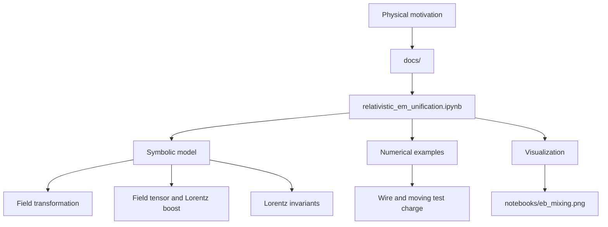
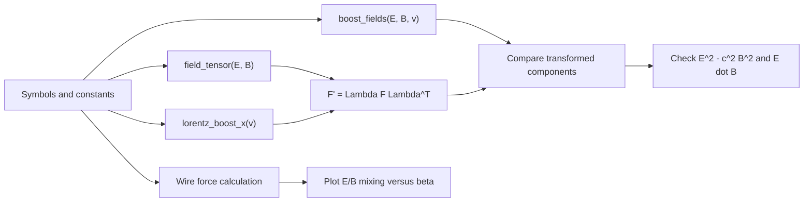
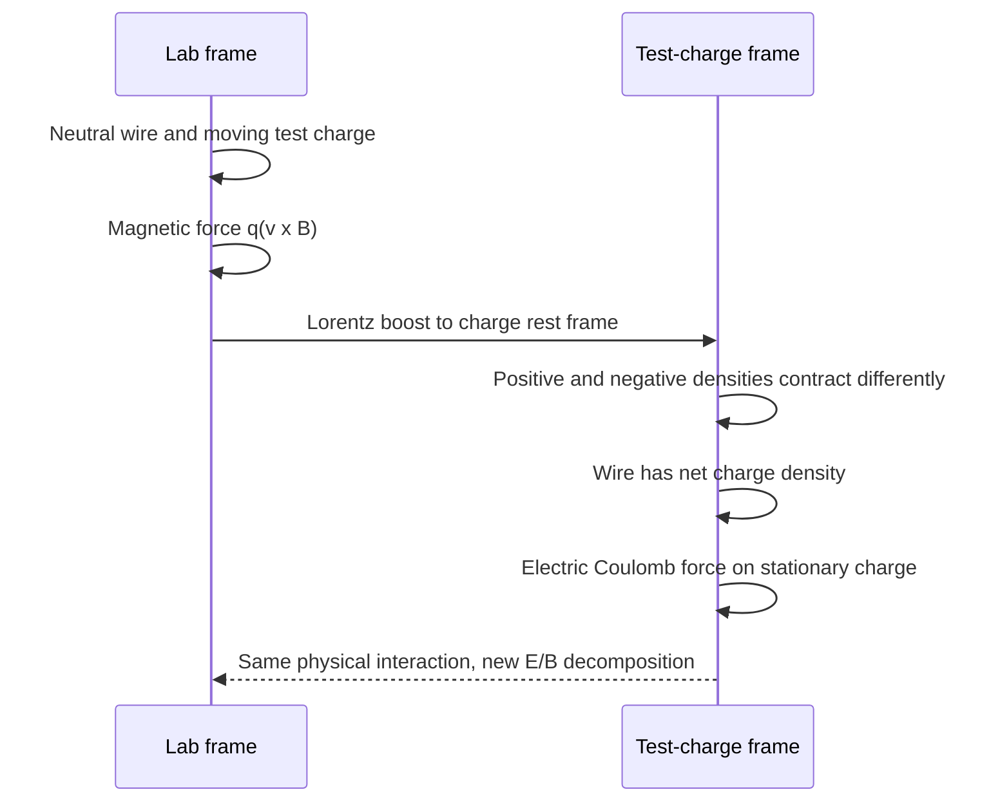

# Relativity Unifies Electricity and Magnetism

A notebook-based physics project that explains the relationship between electric and magnetic fields through special relativity.

The central idea is simple:

> Electricity and magnetism are frame-dependent parts of one electromagnetic field. Changing inertial frames changes how the same field is split into `E` and `B`.

The project develops that idea from physical intuition, through the relativistic field transformations, to the electromagnetic field tensor and Lorentz invariants.

## Contents

- [Why this project](#why-this-project)
- [Conceptual overview](#conceptual-overview)
- [Project architecture](#project-architecture)
- [Repository layout](#repository-layout)
- [Getting started](#getting-started)
- [Notebook modules](#notebook-modules)
- [Core equations](#core-equations)
- [Interpreting the wire example](#interpreting-the-wire-example)
- [Validation and limitations](#validation-and-limitations)
- [Further reading](#further-reading)
- [License](#license)

## Why this project

The familiar statement that a moving charge produces magnetism can make electric and magnetic fields sound like separate phenomena. This project uses the classic current-carrying wire and moving test charge example to show what special relativity adds:

- In the wire frame, a neutral current-carrying wire produces a magnetic force on a moving test charge.
- In the test-charge frame, relativistic length contraction changes the positive and negative charge densities by different amounts.
- The wire therefore has a net charge density in that frame, producing an electric force on the stationary test charge.
- Both observers describe the same physical interaction; they decompose the electromagnetic field differently.

## Conceptual overview

The transformation of the transverse components for a boost along `x` is the key computational example:

```text
        one electromagnetic field
                    |
          Lorentz transformation
                    |
       +------------+------------+
       |                         |
   electric view              magnetic view
       E'                        B'
```

A field that is purely magnetic in one frame can contain an electric component in another. The field itself is not created or destroyed by the change of coordinates; only its frame-dependent components change.

## Project architecture

The repository is intentionally organized as a progression from explanation to executable mathematics:



The notebook data flow is:



## Repository layout

```text
.
├── docs/
│   ├── relativistic_em_intuitively_explained.md  # Physical explanation and references
│   └── relativistic_em_unified_1.00.md           # Detailed derivation and discussion
├── notebooks/
│   ├── relativistic_em_unification.ipynb         # Main executable notebook
│   ├── relativistic_em_unification_bak1.ipynb    # Earlier notebook snapshot
│   └── eb_mixing.png                             # Generated/example visualization
├── scripts/                                      # Reserved for reusable scripts
├── src/                                          # Reserved for reusable Python modules
├── tests/                                        # Reserved for automated tests
├── Standard.json                                 # Repository policy metadata
├── LICENSE                                      # GNU GPL v3
└── README.md
```

At present, the executable implementation lives in the notebook; `src/`, `scripts/`, and `tests/` are extension points for future extraction and automated verification.

## Getting started

### Requirements

- Python 3.10 or newer is recommended.
- Jupyter Notebook or JupyterLab.
- Python packages: `sympy`, `numpy`, and `matplotlib`.

### Install dependencies

From the repository root, create or activate a virtual environment and install the notebook dependencies:

```powershell
python -m venv .venv
.\.venv\Scripts\Activate.ps1
python -m pip install --upgrade pip
python -m pip install sympy numpy matplotlib jupyter
```

### Run the notebook

```powershell
jupyter notebook notebooks/relativistic_em_unification.ipynb
```

Run the cells from top to bottom. The notebook builds symbolic expressions first, then performs numerical checks and produces the field-mixing plot.

## Notebook modules

The main notebook is divided into these modules:

1. **Setup and Maxwell equations**
   - Defines symbols for `E`, `B`, velocity `v`, light speed `c`, and the Lorentz factor `gamma`.
   - Establishes the SI-unit Maxwell equations used as context.

2. **Relativistic field transformation**
   - Implements `boost_fields(E, B, v)` for a boost along the `x` axis.
   - Demonstrates that a pure magnetic field acquires an electric component in a moving frame.

3. **Electromagnetic field tensor**
   - Builds the antisymmetric tensor `F^(mu nu)` with `field_tensor(E, B)`.
   - Builds an `x`-direction Lorentz boost with `lorentz_boost_x(v)`.
   - Verifies the tensor transformation against the direct component formulas.

4. **Lorentz invariants**
   - Checks that `E^2 - c^2 B^2` and `E dot B` remain unchanged under a boost.
   - Uses the invariants as frame-independent sanity checks.

5. **Current-carrying wire thought experiment**
   - Compares the magnetic-force description in the lab frame with the electric-force description in the test-charge frame.
   - Connects the apparent charge imbalance to differential relativistic length contraction.

6. **Visualization**
   - Plots the transformed electric and magnetic components against `beta = v/c`.
   - The checked-in image [`notebooks/eb_mixing.png`](notebooks/eb_mixing.png) shows the growth of mixed field components as the boost approaches the speed of light.

## Core equations

For a boost of speed `v` along `x`, with `gamma = 1 / sqrt(1 - v^2/c^2)`:

```text
E'x = Ex                         B'x = Bx
E'y = gamma (Ey - v Bz)          B'y = gamma (By + v Ez / c^2)
E'z = gamma (Ez + v By)          B'z = gamma (Bz - v Ey / c^2)
```

The electromagnetic field tensor used by the notebook is:

```text
F^(mu nu) = |  0       -Ex/c   -Ey/c   -Ez/c |
            |  Ex/c     0      -Bz      By   |
            |  Ey/c     Bz      0      -Bx   |
            |  Ez/c    -By      Bx      0    |
```

Under a Lorentz transformation `Lambda`:

```text
F' = Lambda F Lambda^T
```

The two scalar invariants used by the notebook are:

```text
E^2 - c^2 B^2 = invariant
E dot B        = invariant
```

## Interpreting the wire example

The wire example is a conceptual bridge between the equations and the physical claim:



Real electron drift speeds in ordinary conductors are extremely small. The notebook's relativistic-speed numerical example is therefore illustrative: it makes the relativistic correction visible with ordinary floating-point arithmetic. It should not be interpreted as a physically realizable conductor operating at a substantial fraction of `c`.

## Validation and limitations

The notebook provides symbolic and numerical checks for:

- Direct electric/magnetic field transformation formulas.
- Agreement between direct transformations and the tensor transformation.
- Preservation of both Lorentz invariants.
- Qualitative agreement between magnetic and electric descriptions of the wire example.

The project is educational rather than a general electromagnetic simulation package. It currently focuses on boosts along `x`, idealized fields, and a specific wire thought experiment. The wire-force calculation is sensitive to frame, density, and sign conventions; numerical agreement should be interpreted alongside the derivation rather than as a standalone production solver.

## Further reading

The project documentation points to these resources:

- [Relativistic electricity and magnetism, Feynman Lectures Volume II, Chapter 13](https://www.feynmanlectures.caltech.edu/II_13.html)
- [George Mason University: Magnetism in Relativity](http://complex.gmu.edu/www-phys/phys262/soln/magnetism%20in%20relativity.pdf)
- [MIT OpenCourseWare 8.022: Physics II - Electricity and Magnetism](https://ocw.mit.edu/courses/8-022-physics-ii-electricity-and-magnetism-fall-2004/)
- [Magnetic Fields & Currents - Feynman Physics Vol. 2](https://www.youtube.com/watch?v=ddDaZJUEHFY&vl=en-US)

For the project's local explanations, start with [`docs/relativistic_em_intuitively_explained.md`](docs/relativistic_em_intuitively_explained.md), then read [`docs/relativistic_em_unified_1.00.md`](docs/relativistic_em_unified_1.00.md), and finally run the notebook.

## License

This project is distributed under the GNU General Public License v3. See [`LICENSE`](LICENSE).
